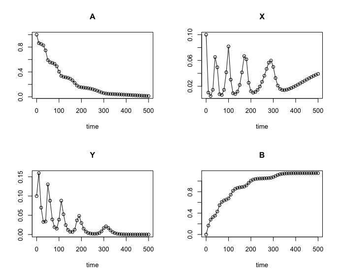
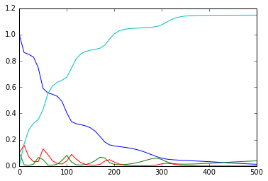

# Parameter Estimation

This directory contains scripts for estimating parameters of an ODE model using Lotka-Volterra model as an example.
Script `simulate_experimental_data.R` can be used to simulate the data. 

The simulated data saved in `lv_nontransformed.txt` file.
Script `parameter_optimization_nonequally_spaced_timepoints.py` performs parameter optimization.

