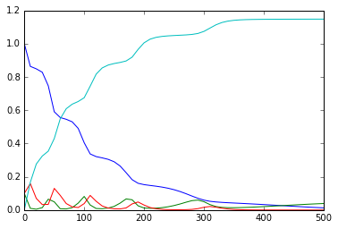

# Examples of Typical Tasks for Handling ODE Systems Biology Models

## Directory: LV_param_estimation
This directory contains scripts for estimating parameters of an ODE model using Lotka-Volterra model as an example.
Script `simulate_experimental_data.R` can be used to simulate the data. 

The simulated data saved in `lv_nontransformed.txt` file.
Script `parameter_optimization_nonequally_spaced_timepoints.py` performs parameter optimization.

---

The following steps in the script perform a few transforms to make the data look more like real experimental biological data.

## Directory: bistable_switch_limit_point_bifurcation
[Tellurium](http://tellurium.analogmachine.org/) has a capability for bifuraction analysis. It leverages the [AUTO2000](https://www.math.auckland.ac.nz/~hinke/dss/continuation/auto.html) tool. An example [script](https://github.com/sys-bio/tellurium-examples/blob/master/bifurcationExample.py) of bifurcation analysis is available at [sys-bio](https://github.com/sys-bio/) repository.
Output of the demo script:

